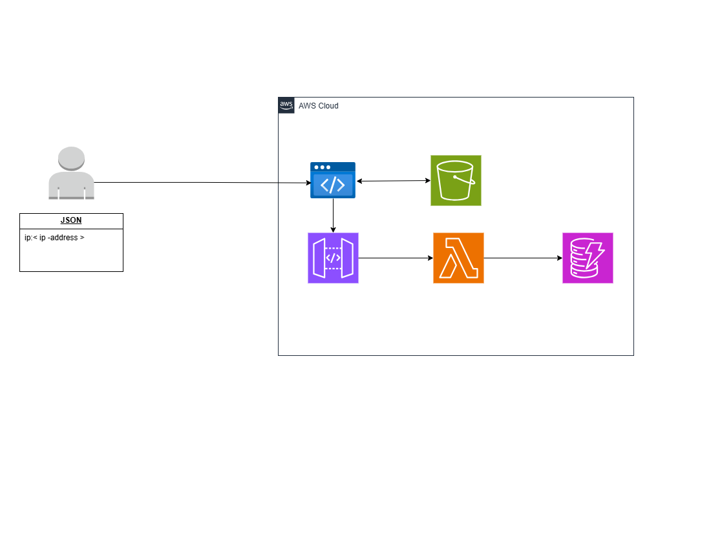

# Cloud Managed Service (AWS)

## Architecture


### Website Architecture on AWS Cloud

- **User**: Represents the end-user interacting with the website.
- **JSON Request**: The user sends a JSON object containing an IP address (`ip:<ip-address>`).

### AWS Cloud Components

- **API Gateway**: Receives the JSON object from the user. It acts as the entry point for all incoming requests.
- **S3 Bucket**: Interacts with the API Gateway, likely for storing or retrieving static content such as images, videos, or other files.
- **Lambda Function**: Processes the data received from the API Gateway. It performs the necessary computations or data transformations.
- **DynamoDB**: Stores the processed data from the Lambda function. It is a NoSQL database service that provides fast and flexible data storage.

### Data Flow

1. The user sends a JSON object to the API Gateway.
2. The API Gateway interacts with the S3 Bucket and forwards the data to the Lambda function.
3. The Lambda function processes the data and stores it in DynamoDB.

### Summary

This architecture demonstrates a serverless approach using AWS services to handle user requests, process data, and store it efficiently. It leverages the scalability and flexibility of AWS components to build a robust and efficient web application.

## Lambda Function (`main.go`)

The Lambda function is responsible for receiving the IP address from the API Gateway and storing it in DynamoDB.

```go
package main

import (
    "context"
    "encoding/json"
    "log"
    "os"

    "github.com/aws/aws-lambda-go/events"
    "github.com/aws/aws-lambda-go/lambda"
    "github.com/aws/aws-sdk-go/aws"
    "github.com/aws/aws-sdk-go/aws/session"
    "github.com/aws/aws-sdk-go/service/dynamodb"
    "github.com/aws/aws-sdk-go/service/dynamodb/dynamodbattribute"
)

var dynamoClient *dynamodb.DynamoDB

type IPData struct {
    IP string `json:"ip"`
}

func saveIPHandler(ctx context.Context, event events.APIGatewayProxyRequest) (events.APIGatewayProxyResponse, error) {
    log.Printf("Received request body: %s", event.Body)

    var data IPData
    err := json.Unmarshal([]byte(event.Body), &data)
    if (err != nil) {
        log.Printf("Error unmarshalling request body: %v", err)
        return events.APIGatewayProxyResponse{StatusCode: 400, Body: "Invalid request body"}, nil
    }

    if data.IP == "" {
        log.Printf("IP address is empty")
        return events.APIGatewayProxyResponse{StatusCode: 400, Body: "IP address is empty"}, nil
    }

    av, err := dynamodbattribute.MarshalMap(data)
    if err != nil {
        log.Printf("DynamoDB marshal error: %v", err)
        return events.APIGatewayProxyResponse{StatusCode: 500, Body: "Error marshalling data"}, nil
    }

    tableName := os.Getenv("DYNAMODB_TABLE_NAME")
    if tableName == "" {
        log.Printf("DynamoDB table name not set")
        return events.APIGatewayProxyResponse{StatusCode: 500, Body: "DynamoDB table name not set"}, nil
    }

    input := &dynamodb.PutItemInput{
        TableName: aws.String(tableName),
        Item:      av,
    }

    _, err = dynamoClient.PutItemWithContext(ctx, input)
    if err != nil {
        log.Printf("DynamoDB insert error: %v", err)
        return events.APIGatewayProxyResponse{StatusCode: 500, Body: "Error saving data to DynamoDB"}, nil
    }

    return events.APIGatewayProxyResponse{StatusCode: 200, Body: "Data saved successfully"}, nil
}

func main() {
    // Initialize DynamoDB client
    sess := session.Must(session.NewSession(&aws.Config{
        Region: aws.String("ca-central-1"),
    }))
    dynamoClient = dynamodb.New(sess)

    // Start Lambda handler
    lambda.Start(saveIPHandler)
}
```

## HTML Script Explanation

The script section in the `index.html` file is responsible for fetching the public IP address of the user and sending it to the AWS Lambda function via the API Gateway. Here is a step-by-step explanation:

1. **Fetch Public IP Address**: The script uses the `fetch` API to call `https://api.ipify.org?format=json`, which returns the public IP address of the user in JSON format.
2. **Send IP Address to Lambda Function**: Once the IP address is obtained, the script sends it to the Lambda function using another `fetch` call to the API Gateway endpoint (`https://gif7m2ahf4.execute-api.ca-central-1.amazonaws.com/SaveIP`). The IP address is sent in the body of the request as a JSON object.
3. **Handle Response**: The script logs the success or error message to the console based on the response from the Lambda function.

This script automates the process of capturing the user's IP address and storing it in DynamoDB via the Lambda function.

## Additional Resources

For more information on various methods to create a web application using cloud services, refer to the [Cloud Portfolio Many Methods](../README.md) main README.